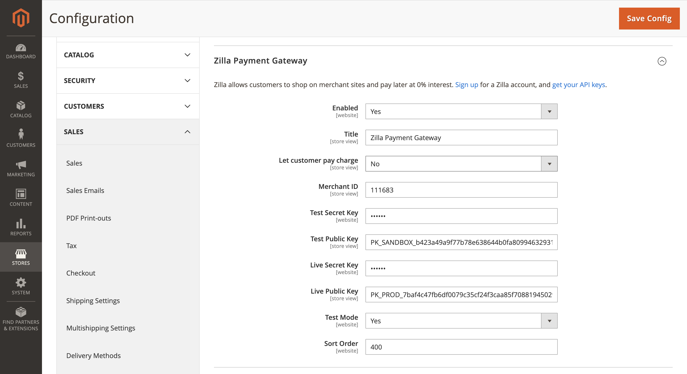

# Installation
using composer, in your magento webroot, issue the following commands:

```
composer require zilla/magento2-module
php bin/magento module:enable Zilla_Payments
php bin/magento setup:upgrade
php bin/magento setup:di:compile
php bin/magento setup:static-content:deploy
```

if for some reason composer is not available, obtain the files from the repo, and place them in app/code/Zilla/Payments and then
```
php bin/magento module:enable Zilla_Payments
php bin/magento setup:upgrade
php bin/magento setup:di:compile
php bin/magento setup:static-content:deploy
```

# Configuration
1. Navigate to Stores → Configuration
2. Navigate to Sales → Payments Method



- **Enable** - this option allows you to enable the Zilla Payment with your Magento store(s). Before enabling the extension, you must fill in the test and live keys.
- **Merchant ID** - is given to you by Zilla when setting up account.
- **Test secret key** - is given to you by Zilla when setting up account.
- **Test public key** - is given to you by Zilla when setting up account.
- **Live secret key** - is given to you by Zilla when setting up account.
- **Live public key** - is given to you by Zilla when setting up account.
- **Test Mode** - select Yes, to enable test environment.

1. Merchant ID
2. Test secret key
3. Test public key
4. Live secret key
5. Live public key
6. Save Config
7. Enable = Yes
8. Save Config
